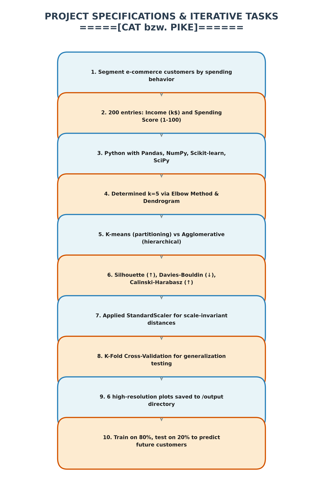

# Title: Project Specifications & Iterative Tasks
# CAT bzw. PIKE
1. **Core Objective**: 
Segment e-commerce customers into distinct spending behavior groups using unsupervised learning.
2. **Dataset Composition**: 
200 entries consisting of Customer ID, Annual Income (k$), and Spending Score (1-100).
3. **Tech Stack**: 
Python with Pandas, NumPy, Matplotlib, Seaborn, Scikit-learn, and SciPy.
4. **Optimal Clusters**: 
Determined k=5 based on the Elbow Method and Dendrogram analysis.
5. **Algorithms Applied**: 
Implemented K-means (partitioning) and Agglomerative Clustering (hierarchical) for comparative evaluation.
6. **Internal Validation Metrics**: 
Utilized Silhouette Score (higher is better), Davies-Bouldin Index (lower is better), and Calinski-Harabasz Index (higher is better).
7. **Data Preprocessing**: 
Applied StandardScaler to standardize features, ensuring scale-invariant distance calculations.
8. **Model Validation**: 
Employed K-Fold Cross-Validation to evaluate the model's generalization capability on unseen data.
9. **Final Outputs**: 
All visualizations (6 plots) are exported to the `output/` directory for comprehensive documentation.
10. **Deployment Simulation**: 
Trained the model on 80% of the data and tested it on 20% to predict the segment of any future customer based solely on their income and spending score.

---

