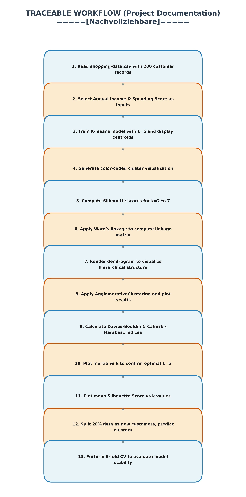

# Title: Traceable Workflow / Project Documentation
# Nachvollziehbare / Projektbeschreibung
1. **Data Loading**: 
Read `shopping-data.csv`, containing 200 customer records.
2. **Feature Extraction**: 
Select Annual Income and Spending Score as the input features for the clustering model.
3. **K-means Fitting**: 
Train the K-means model with k=5, then display cluster centroids and point labels.
4. **Initial Cluster Visualization**: 
Generate a scatter plot with color-coded clusters and save it as `01_Clusters.png`.
5. **Silhouette Analysis**: 
Compute the Silhouette Coefficient for k values ranging from 2 to 7 and print the averages.
6. **Hierarchical Modeling**: 
Apply Ward's linkage method to compute the linkage matrix for hierarchical clustering.
7. **Dendrogram Plotting**: 
Render the dendrogram to visualize hierarchical relationships and save it as `02_Dendrogram.png`.
8. **Agglomerative Clustering**: 
Apply `AgglomerativeClustering` and save the resulting scatter plot as `03_scatter.png`.
9. **Additional Metrics**: 
Calculate the Davies-Bouldin Index and Calinski-Harabasz Index for a more robust evaluation.
10. **Elbow Curve**: v
Plot Inertia against the number of clusters (k) to confirm that k=5 is optimal, saved as `04_Elbow.png`.
11. **Silhouette Curve**: 
Plot the mean Silhouette Score against various k values and save it as `05_Silhouette_vs_k.png`.
12. **Train/Test Split**: 
Split 20% of the data to simulate new customers, predict their clusters, and save the plot as `07_TestSet_Predictions.png`.
13. **Cross-Validation**: 
Perform 5-fold Cross-Validation to compute the mean Silhouette Score and assess model stability.

---

